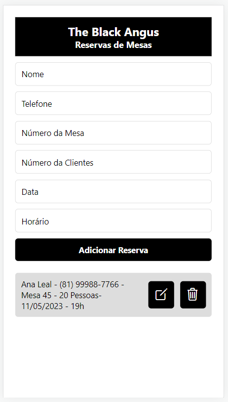
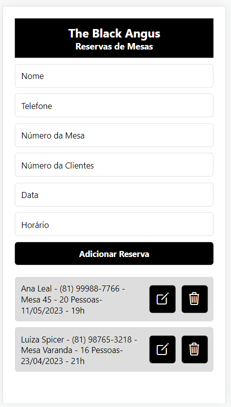
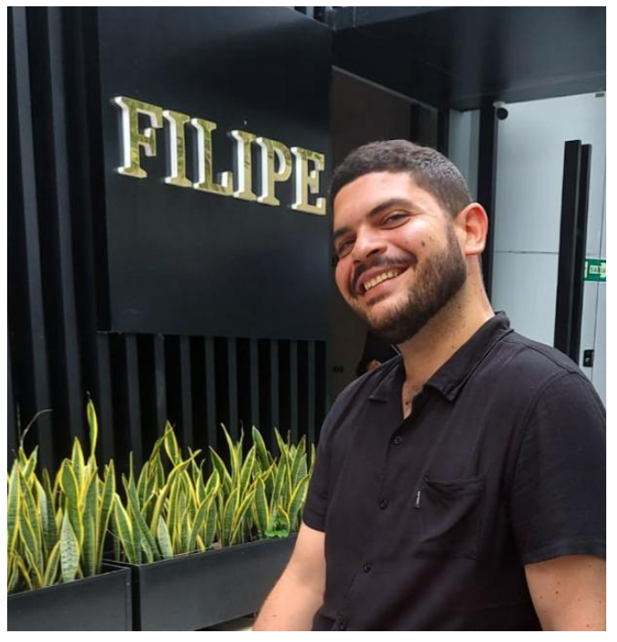

# Projeto Reserva The Black Angus
---
## 😎 Sobre 
Um aplicativo para fazer reservas, permitindo que os funcionários pesquisem e reservem mesas em tempo real; de forma simples e rápida e com um menu de fácil acesso.
Os funcionários podem facilmente reservar uma mesa com o uso do aplicativo, deixando de lado a agenda física e facilitando o acesso às informações em qualquer lugar. Motivando assim, a eficiência operacional, otimizando o gerenciamento de recursos e aumentando a receita do restaurante. O restaurante também pode gerenciar melhor sua capacidade e demanda, reduzir custos e melhorar a organização do trabalho dos colaboradores. 
O aplicativo contém campos de digitação para informações como nome do cliente, telefone, data da reserva, horário, quantidade de pessoas e a mesa que será reservada.

---

## 🗂️ Indice 
- <a href="#-funcionalidadesdo--aplicativo">Funcionalidades do plicativo</a>
- <a href="#-layout">Layout</a>
- <a href="#-tecnologias-utiziladas">Tecnologia utiziladas</a>
- <a href="#-autores">Autores</a>
- <a href="#-proximos-passos">Próximos passos</a>

---

## 📱 Funcionalidades do aplicativo

- Reservar mesa por nome do cliente e possibilidade de adicionar outras informações.
- Escolha de mesa pelo clinete e possibilidade de incluir observações.
- Preview em tempo real das reservas agendadas.

---

## 🖼️ Layout

---

## 🚀 Tecnologia utiziladas

1. [ReactJS](https://react.dev)
2. [@expo/vector-icons](https://icons.expo.fyi/)

---

## 🕺💃 Desenvolvido por 
        Filipe Matheus de Oliveira Arruda Alves

        Pollyanna Botelho Ranzan

---